# Создание проекта для stm32f103c8t6 Black Pill в STM32CubeIDE, с использованием CMSIS.

Здесь я попытаюсь рассказать как создать минимальный проект на CMSIS с использованием STM32CubeIDE, на примере stm32f103c8t6 Black Pils.

## 1. Дистрибутив, библиотеки и доки.

Все необходимые ресурсы можно скачать с сайта [st.com](https://www.st.com/content/st_com/en.html), и вот что понадобится:

* [Среда разработки STM32CubeIDE](https://www.st.com/content/st_com/en/products/development-tools/software-development-tools/stm32-software-development-tools/stm32-ides/stm32cubeide.html)   
    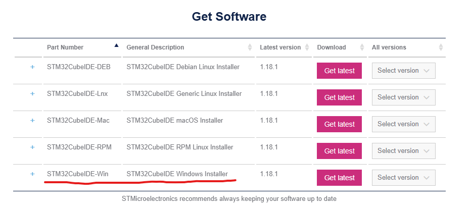   
    Я использую Windows
* [Библиотека CMSIS для ARM Cortex-M3](https://www.st.com/en/embedded-software/stm32cubef1.html), она находится в архиве STM32CubeF1 / \STM32Cube_FW_F1_V1.8.0\    
    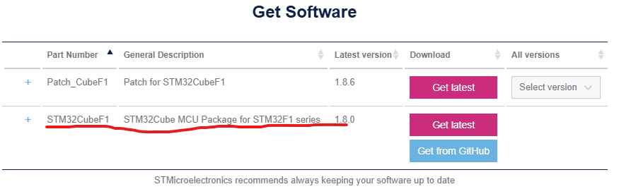  
    Так же все необходимаые файлы можно скачать с гита:   
    * [STM32CubeF1](https://github.com/STMicroelectronics/STM32CubeF1)  
    * [cmsis-device-f1](https://github.com/STMicroelectronics/cmsis-device-f1)  
* [Datasheet](https://www.st.com/resource/en/datasheet/stm32f103c8.pdf)
* [Reference manual](https://www.st.com/resource/en/reference_manual/cd00171190.pdf)
* [Programming manual](https://www.st.com/resource/en/programming_manual/cd00228163.pdf)
* [Errata sheet](https://www.st.com/resource/en/errata_sheet/cd00190234.pdf)

## 2. Устанваливаем IDE ...

## 3. Создание проекта.

После установки, запуска и выбора папки Workspace можно начать создание проекта.

1. Создаём новый проект — File/New/STM32Project.   

    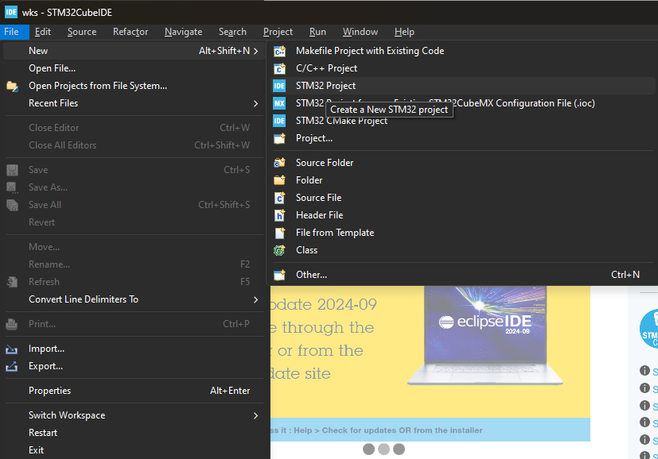  

2. Выбираем наш микроконтроллер stm32f103c8t6  

    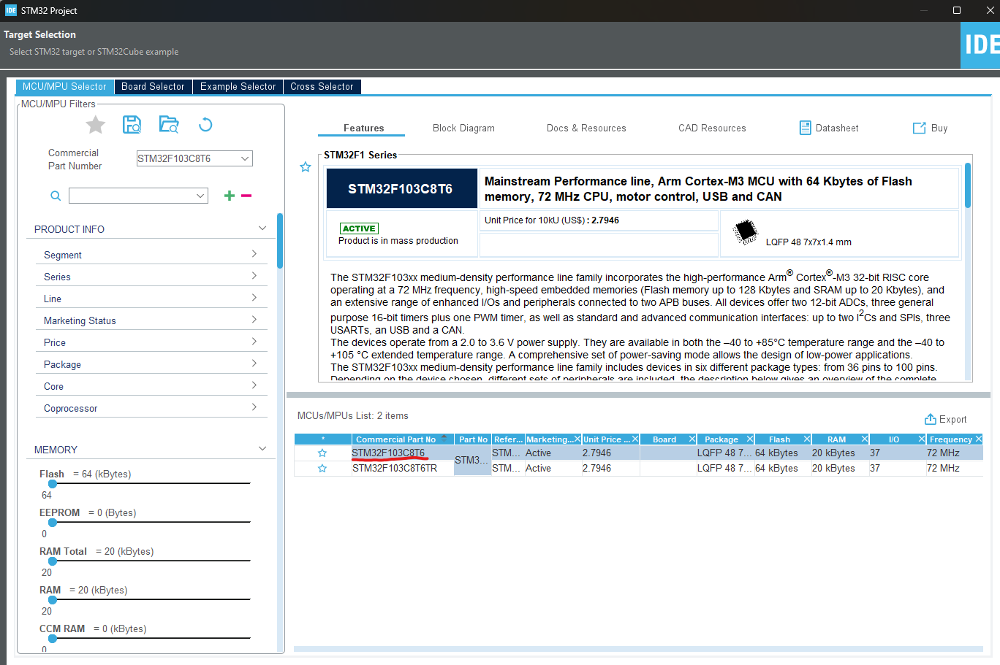  

3. Создаем проект CMSIS_proj, тип проекта Empty — финиш.  

    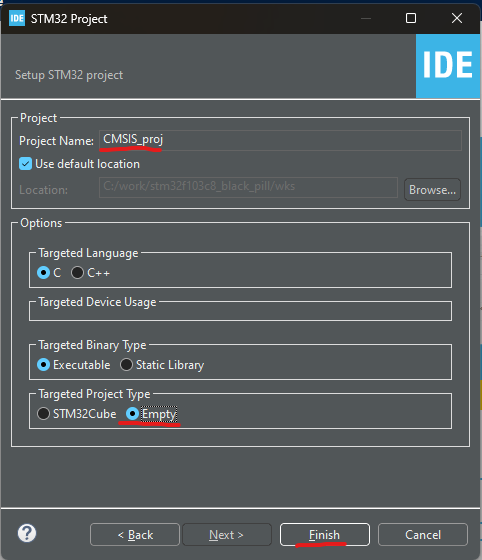  

4. Слева, в окне Project Explorer, появилось дерево проекта.

    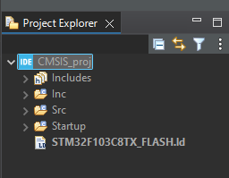  

5. Тут мы видим файл скрипта линкера `STM32F103C8TX_FLASH.ld`, оставляем его, а всё остальное удаляем (страдаем перфекционизмой). 
Все манипуляции с папками и файлами можно проводить как в проводнике так и внутри IDE, нажав правой кнопкой на название проекта, к примеру: правая кнопка –> new –> Folder. Если структура проекта изменялась вне IDE, то нужно просто обновить проект: правая кнопка –> Refresh.

    Мне нравится такой, чесно спертый, вариант структуры:  
    * `Startup` – здесь будет храниться скрипт линкера, тот самый, оставшийся от сгенерированного проекта, а также startup  файл взятый из CMSIS.  
    * `CMSIS\src` и `CMSIS\inc` – здесь будут лежать исходники, файлы с расширением `*.c` в папке `src` и заголовочные  файлы с расширением `*.h` в папке `inc` соответственно, относящиеся к библиотеке CMSIS.  
    * `Core\src` и `Core\inc` – здесь будет расположен собственно сам проект, для начала стоит положить туда `main.c` и     `main.h`.  

6. Теперь нужно перенести файлы библиотеки CMSIS в проект. Библиотека состоит из файлов ядра и файлов периферии. Файлы ядра начинаются с core_ или cmsis_ они общие для всех микроконтроллеров, использующих данное ядро. Файлы периферии содержат в названии наименование микроконтроллера stm32 и специфичны для конкретного производителя, в данном случае, компании STM.

    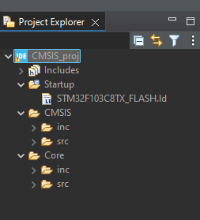  

7. Библиотека CMSIS ***обзор для общего внимания, не обязательная часть***  
    Архив с STM32CubeF1 скачали, разархивировали. В нем содержится много разных вещей: документация, примеры для отладочных плат, драйверы HAL и сам CMSIS, который нам и нужен. CMSIS расположен в .\STM32Cube_FW_F1_~~~\Drivers\CMSIS  
    Вначале идем в .\CMSIS\Device\ST\STM32F1xx\Include:  
    У нас тут куча .h файлов для разных микроконтроллеров, но чего-нибудь наподобие stm32f103x8.h не видно. Открываем stm32f1xx.h. Там есть вот такая вещь:  
    ```c
    #if !defined (STM32F100xB) && !defined (STM32F100xE) && !defined (STM32F101x6) && \
        !defined (STM32F101xB) && !defined (STM32F101xE) && !defined (STM32F101xG) && !defined (STM32F102x6) && !defined (STM32F102xB) && !defined (STM32F103x6) && \
        !defined (STM32F103xB) && !defined (STM32F103xE) && !defined (STM32F103xG) && !defined (STM32F105xC) && !defined (STM32F107xC)
    /* #define STM32F100xB  */   /*!< STM32F100C4, STM32F100R4, STM32F100C6, STM32F100R6, STM32F100C8, STM32F100R8, STM32F100V8, STM32F100CB, STM32F100RB and STM32F100VB */
    /* #define STM32F100xE */    /*!< STM32F100RC, STM32F100VC, STM32F100ZC, STM32F100RD, STM32F100VD, STM32F100ZD, STM32F100RE, STM32F100VE and STM32F100ZE */
    /* #define STM32F101x6  */   /*!< STM32F101C4, STM32F101R4, STM32F101T4, STM32F101C6, STM32F101R6 and STM32F101T6 Devices */
    /* #define STM32F101xB  */   /*!< STM32F101C8, STM32F101R8, STM32F101T8, STM32F101V8, STM32F101CB, STM32F101RB, STM32F101TB and STM32F101VB */
    /* #define STM32F101xE */    /*!< STM32F101RC, STM32F101VC, STM32F101ZC, STM32F101RD, STM32F101VD, STM32F101ZD, STM32F101RE, STM32F101VE and STM32F101ZE */ 
    /* #define STM32F101xG  */   /*!< STM32F101RF, STM32F101VF, STM32F101ZF, STM32F101RG, STM32F101VG and STM32F101ZG */
    /* #define STM32F102x6 */    /*!< STM32F102C4, STM32F102R4, STM32F102C6 and STM32F102R6 */
    /* #define STM32F102xB  */   /*!< STM32F102C8, STM32F102R8, STM32F102CB and STM32F102RB */
    /* #define STM32F103x6  */   /*!< STM32F103C4, STM32F103R4, STM32F103T4, STM32F103C6, STM32F103R6 and STM32F103T6 */
    /* #define STM32F103xB  */   /*!< STM32F103C8, STM32F103R8, STM32F103T8, STM32F103V8, STM32F103CB, STM32F103RB, STM32F103TB and STM32F103VB */
    /* #define STM32F103xE */    /*!< STM32F103RC, STM32F103VC, STM32F103ZC, STM32F103RD, STM32F103VD, STM32F103ZD, STM32F103RE, STM32F103VE and STM32F103ZE */
    /* #define STM32F103xG  */   /*!< STM32F103RF, STM32F103VF, STM32F103ZF, STM32F103RG, STM32F103VG and STM32F103ZG */
    /* #define STM32F105xC */    /*!< STM32F105R8, STM32F105V8, STM32F105RB, STM32F105VB, STM32F105RC and STM32F105VC */
    /* #define STM32F107xC  */   /*!< STM32F107RB, STM32F107VB, STM32F107RC and STM32F107VC */  
    #endif    
    ```
    Обращаем внимание на строчку:
    ```c
    /* #define STM32F103xB  */   /*!< STM32F103C8, STM32F103R8, STM32F103T8, STM32F103V8, STM32F103CB, STM32F103RB, STM32F103TB and STM32F103VB */
    ```
    Ага, STM32F103C8 тут есть. Значит для нашего микроконтроллера подойдут исходники, от B версии: STM32F103xB. Запомним это. Из этой папки копируем в CMSIS проекта следующие файлы:
    ```
    stm32f1xx.h
    stm32f103xb.h
    system_stm32f1xx.h
    ```
    Далее переходим в ``.\CMSIS\Device\ST\STM32F1xx\Source\Templates`` и отсюда забираем файл ``system_stm32f1xx.c``

    После нам нужен стартап-файл. Заходим в ``.\CMSIS\Device\ST\STM32F1xx\Source\Templates\gcc``. Там нас так же ждет большое количество файлов и мы так же ищем тот, который оканчивается на xB: ``startup_stm32f103xb.s``.

    Затем переходим в .\CMSIS\Include и забираем вот эти 3 файла:
    ```
    core_cm3.h
    core_cmFunc.h
    core_cmInstr.h    
    ```

    Так как в STM32F103C8 микропроцессорное ядро Cortex M3, то и берем соответствующие исходники.

    Итого 8 файлов:
    ```
    + stm32f1xx.h
    + stm32f103xb.h
    + system_stm32f1xx.h
    + system_stm32f1xx.c
    + startup_stm32f103xb.s
    + core_cm3.h
    - core_cmFunc.h
    - core_cmInstr.h
    ```


7. Достаём из архива (или github), все пути указаны относительно этой папки, следующие файлы. Итого, нужно скопировать:

    В CMSIS\inc:  

    * Drivers\CMSIS\Include\cmsis_compiler.h  
    * Drivers\CMSIS\Include\cmsis_gcc.h  
    * Drivers\CMSIS\Include\cmsis_version.h  
    * Drivers\CMSIS\Include\core_cm3.h  
    * Drivers\CMSIS\Device\ST\STM32F1xx\Include\stm32f1xx.h  
    * Drivers\CMSIS\Device\ST\STM32F1xx\Include\stm32f103xb.h  
    * Drivers\CMSIS\Device\ST\STM32F1xx\Include\system_stm32f1xx.h  

    В CMSIS\src:  

    * Drivers\CMSIS\Device\ST\STM32F1xx\Source\Templates\system_stm32f1xx.c  

    В Startup:  

    * Drivers\CMSIS\Device\ST\STM32F1xx\Source\Templates\gcc\startup_stm32f103xb.s  

    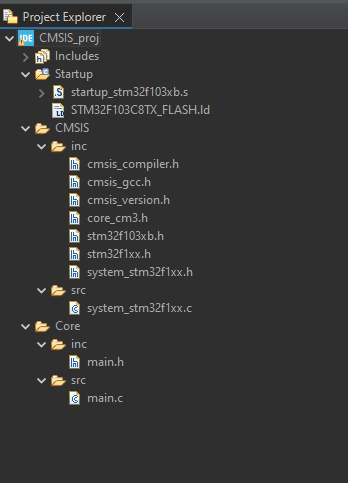

8. Так как были проведены некоторые манипуляции с папками проекта, нужно отобразить это в настройках.  
    Правая кнопка по названию проекта -> Properties -> C/C++ Build -> Settings -> Tool Settings -> MCU GCC Linker -> General – здесь нужно указать новое расположение скрипта линкера с помощью кнопки Browse…

    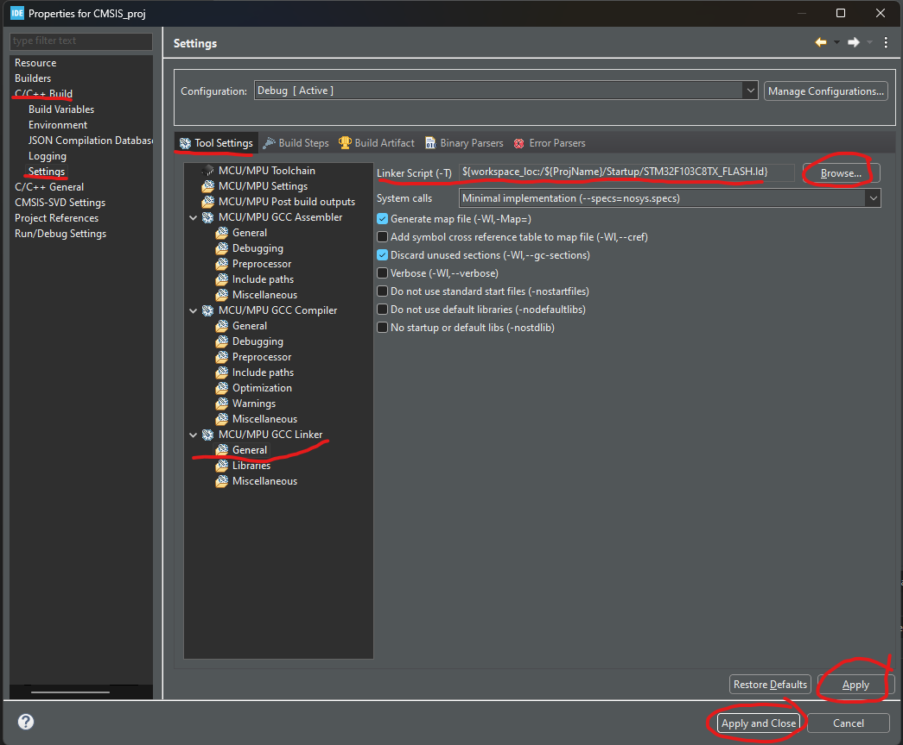

9. Также нужно указать пути к файлам проекта   
    **Properties -> C/C++ General -> Path and Symbols -> Includes**  
    **Properties -> C/C++General -> Path and Symbols -> Source Location**  
    В Includes пути к папкам inc, а в Source Location логично было-бы к папкам src, но если так сделать, то в дереве проекта будут отдельно добавлены эти папки. Чтобы не загромождать визуально дерево, в Source Location можно указать корневые папки Core, CMSIS и Startup.

    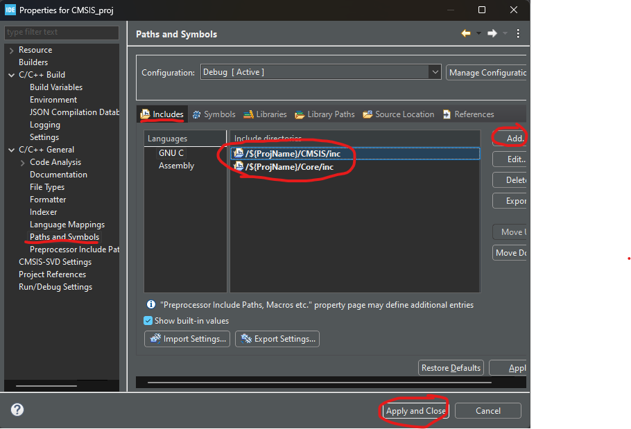  
    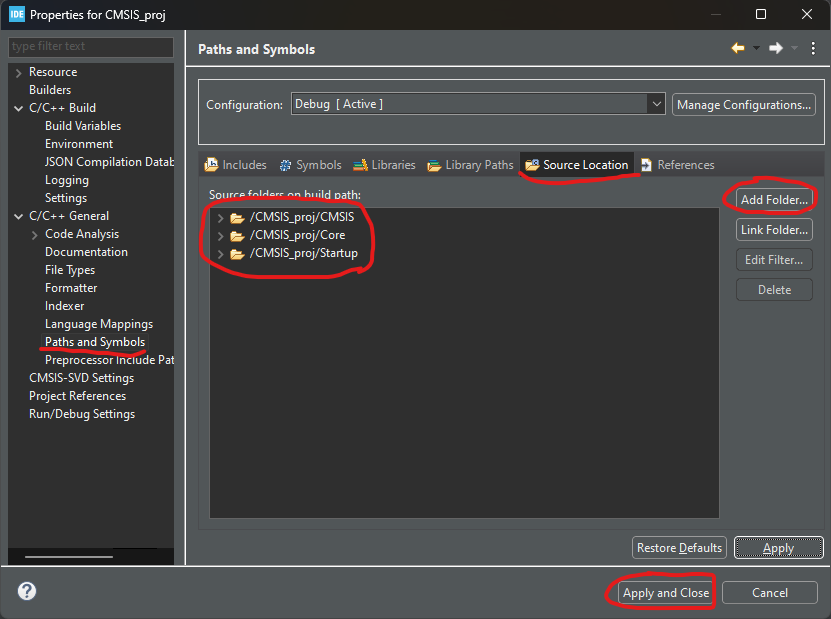  

10. После этого открываем файл stm32f1xx.h и раскомментируем стоку с #define STM32F103xB:

    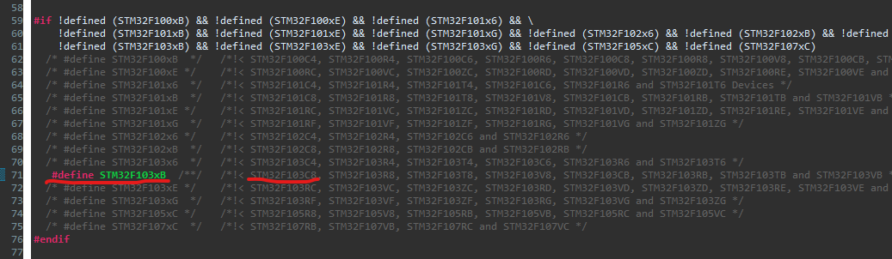

11. Далее пишем следующий main:
    ```c
    #include "stm32f1xx.h"
    int main()
    {
        return 0;
    }
    ```

13. Выбираем Project->Build All. Если все сделали правильно, то получаем сообщение об успешной компиляции проекта, если выскочила ошибка попробуйте ещё раз, если опять, то значит что то пошло не так:

    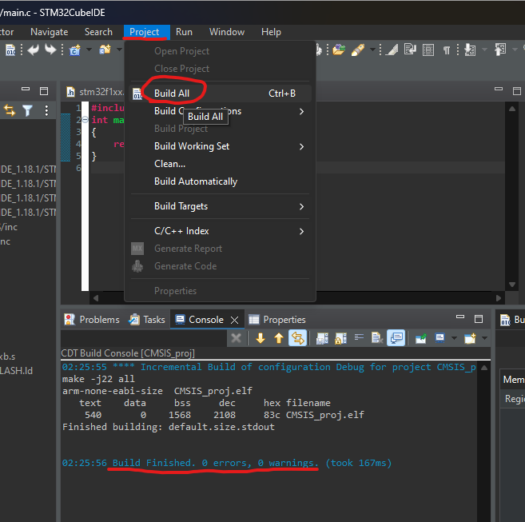


## Ахтунг
> Собственно всё. Безошибочная компиляция и сразу же куда-то подевалось целых полтора килобайта памяти ОЗУ она же RAM, и сразу же вспоминается стек и куча, в процессе создания проекта они нигде не упоминались. Величина стека и кучи указана в файле скрипта линкера, тот что с расширением **.ld**, их можно и нужно изменять в соответствии с требованиями проекта. Эти значения находятся в начале файла в виде меток **_Min_Heap_Size**/**_Min_Stack_Size** с указанием размера в шестнадцатеричном виде.

