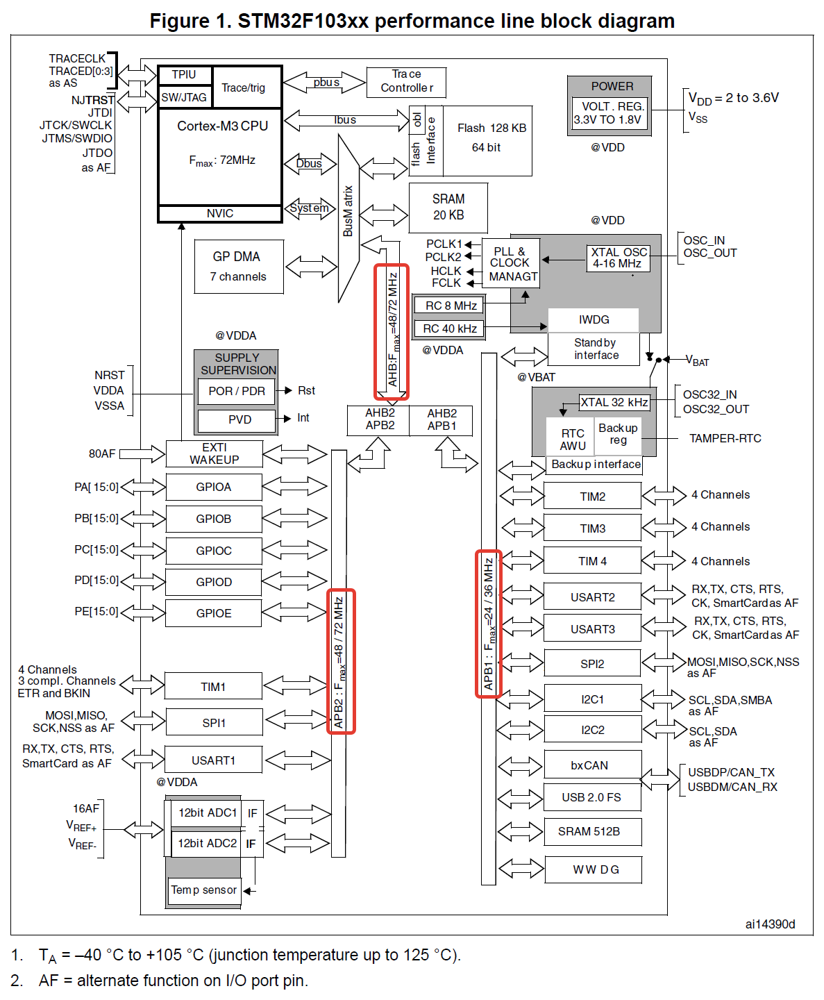
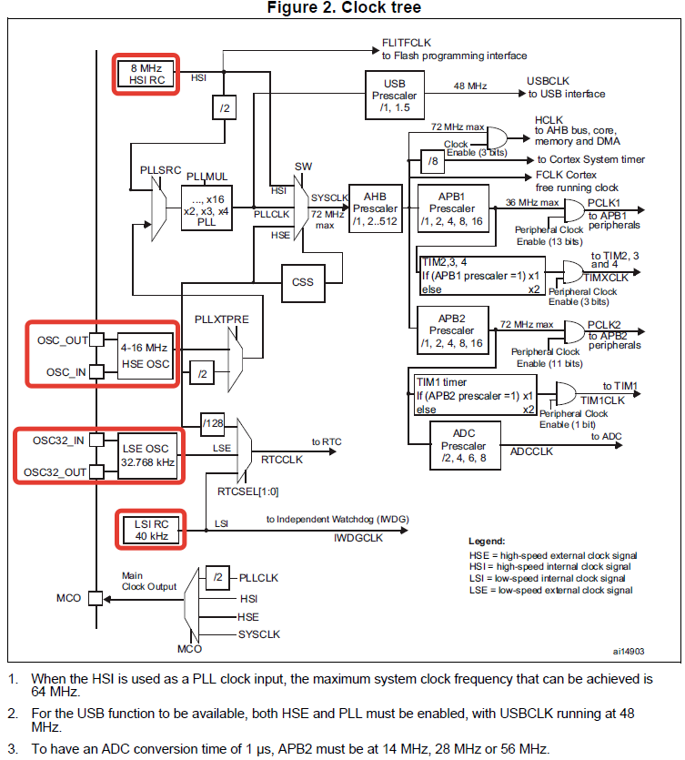
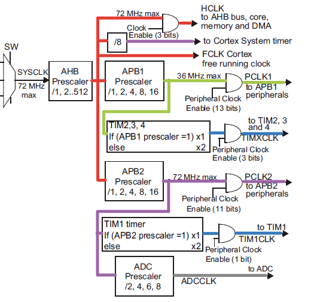
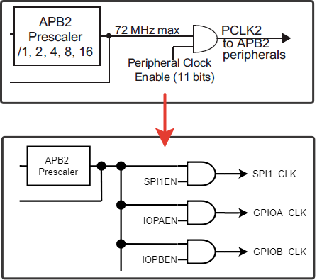
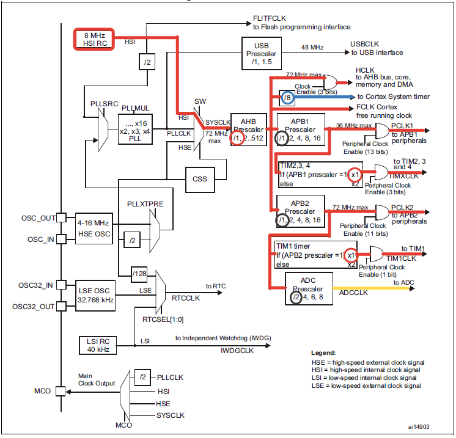
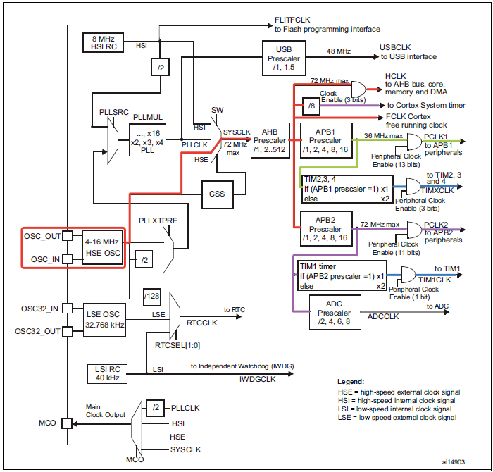
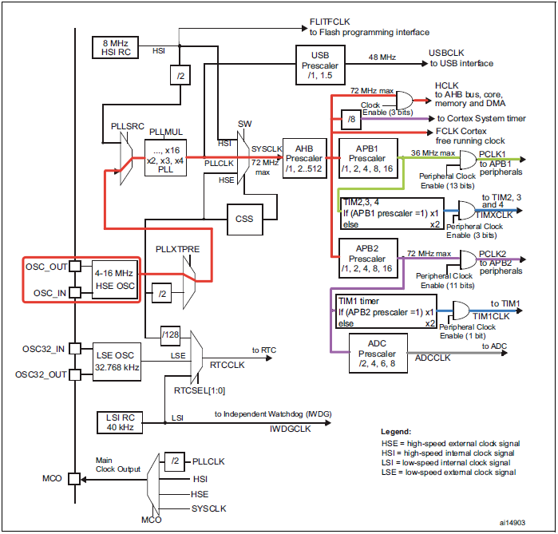

# Система тактирования для stm32f103.

## Блок-схема микроконтроллера STM32F103x8

## Шины
В STM32F103x8 три основных шины: AHB, APB1 и APB2. На каждой из шин висит определенная группа устройств:
* AHB (up to 72 MHz): процессорное ядро, память и DMA;
* APB1 (up to 36 MHz): USART2, USART3, I2C1/2, CAN, таймеры TIM2..4;
* APB2 (up to 72 MHz): порты GPIO, АЦП, USART1, TIM1, SPI1.

1. Все периферийные устройства в микроконтроллерах STM32 подключены к шинам (AHB, APB1 и APB2), через которые производится взаимодействие с устройствами и подача на них тактовых сигналов;  
2. Шины микроконтроллера STM32 могут иметь разные частоты тактирования;  
3. Перед началом работы с периферийным устройством необходимо разрешить подачу на него тактового сигнала.  

## Блок-схема системы тактирования

### **HSI** (High-speed internal RC oscillator)  
Встроенный RC-генератор на 8 МГц. После сброса микроконтроллер по-умолчанию тактируется как раз от этого генератора.  

### **HSE** (High-speed external).  
Для его работы нужен внешний кварцевый резонатор на частоту 4-16 МГц. Его главным преимуществом в сравнении с HSI является стабильность генерируемой частоты. Так же, при определенной настройке, вывод OSC_IN можно подключить к источнику готового прямоугольного тактового сигнала без использования резонатора.

### **LSE** (Low-speed external).  
Генератор требует внешнего кварцевого резонатора, но только на 32768 Гц. LSE используется только для тактирования встроенных часов реального времени RTC, если это нужно.

### **LSI** (Low-speed internal RC oscillator).  
Это встроенный RC-генератор на 40 КГц. Он не отличается особой точностью, однако у него есть очень важная задача: генерация тактового сигнала для сторожевого таймера МК, который перезапустит систему в случае зависания.  

## Тактирование переферии  

### Распределение тактового сигнала SYSCLK

Тактовый сигнал на таймеры подается следующим образом. Если делитель шины (APB1 Prescaler или APB2 Prescaler) установлен в единицу, то частота тактирования тактирования таймеров (TIMXCLK или TIM1CLK) будет равна частоте шины. Но, если делитель не равен единице, то частота тактирования таймеров будет в 2 раза больше частоты шины. Для АЦП есть свой собственный делитель, который из частоты тактирования шины APB2 формирует сигнал ADCCLK.   

  

У каждого периферийного модуля в специальном регистре есть свой бит (SPI1EN, IOPAEN, IOABEN и так далее), при установке которого в единицу разрешается подача на него тактового сигнала.   

## Источники сигнала SYSCLK  

Основным тактовым сигналом в микроконтроллерах STM32 является SYSCLK. В нашем распоряжении 3 варианта: генераторы HSI, HSE и модуль PLL:

### Конфигурация системы тактирования по-умолчанию HSI   

  

### Выбор генератора HSE в качестве источника тактирования SYSCLK   

  

### Схема прохождения тактового сигнала при использовании PLL совместно с HSE   

  

Кварцевый резонатор выбираем на 8 МГц. Далее, сигнал с HSE без деления (настраивается битом PLLXTPRE) поступает на селектор PLLSRC и потом на PLL. Для того, чтобы из 8-и МГц получить 72 МГц, коэффициент умножения PLL должен быть равен PLLMUL=9. Далее, сигнал с PLL частотой 72 МГц через селектор SW поступает на SYSCLK. Так как процессорное ядро мы хотим тактировать максимальной частотой в 72 МГц, AHB Prescaler устанавливаем равный единице (без деления). Для получения частоты шины APB1, равной 36 МГц, APB1 Prescaler ставим равным 2. Шина APB2 имеет максимальную частоту 72 МГц, следовательно, APB2 Prescaler можно установить в 1.

### Итого:
* Кварц HSE на 8 МГц
* PLLXTPRE: без деления
* PLLSRC: HSE генератор
* PLLMUL = 9
* SW = PLLCLK
* AHB Prescaler = 1
* APB1 Prescaler = 2
* APB2 Prescaler = 1

## А так же 

1. **Clock security system (CSS)** — переводится примерно как «система безопасности тактирования». Если, при использовании генератора HSE в качестве источника тактового сигнала для SYSCLK или PLL, произойдет срыв генерации HSE, то CSS автоматически переключит всю систему на работу от встроенного RC-генератора HSI. Таким образом, если что-то случится с кварцем, система не зависнет намертво в неопределенном состоянии, а сможет выполнить какие-то действия, например, перевести объект управления в безопасное состояние (закрыть все вентили, отключить силовые установки, и т.д.)  

2. **Модуль часов реального времени RTC** может тактироваться от встроенного LSI генератора на 40 КГц, от HSE через делитель на 128, либо от LSE с внешним кварцем на 32768 Гц. Источник тактовых импульсов выбирается с помощью RTCSEL.  

3. **Модуль USB** получает тактовый сигнал от PLL, причем при частоте на выходе PLL равной 72 МГц есть возможность активировать USB Prescaler с коэффициентом деления 1.5 для получения необходимой частоты 48 МГц.  

4. **Microcontroller clock output (MCO)** — вывод микроконтроллера, на который можно вывести частоту от одного из источников сигнала: SYSCLK, HSE, HSI либо сигнал с выхода PLL, поделенный пополам. Нужный источник выбирается с помощью битов MCO.  
