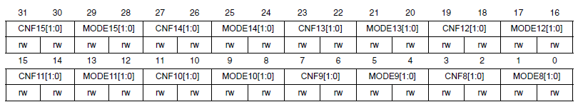
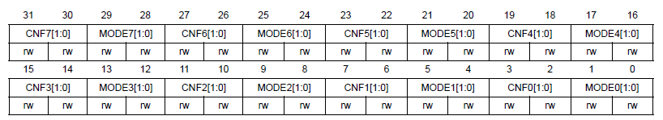
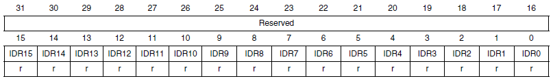
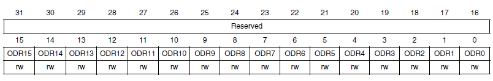
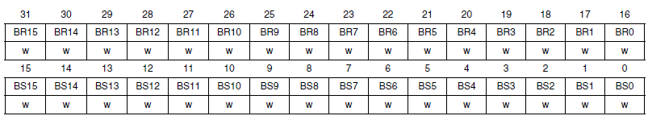
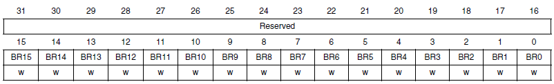
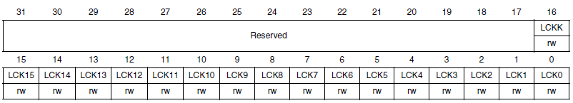

# Порты ввода-вывода GPIO   

Каждый GPIO имеет 16 линий ввода/вывода, причем каждая линия может быть настроена независимо от других. Вот варианты настройки:

* **Input floating** - вход с отключенными подтягивающими резисторами
* **Input pull-up** - вход с подтяжкой к логической единице
* **Input-pull-down** - вход с подтяжкой к логическому нулю
* **Analog** - аналоговый вход (например, для АЦП)
* **Output open-drain** - выход с открытым  коллектором (записали 1 — выход в высокоимпедансном состоянии, записали 0 — выход прижат внутренним транзистором к земле)
* **Output push-pull** - выход «тяни-толкай» (записали 1 — на выходе лог. 1, записали 0 — на выходе лог. 0)
* **Alternate function push-pull** - альтернативная функция в режиме «тяни-толкай»
* **Alternate function open-drain** - альтернативная функция в режиме открытого коллектора

Каждому выводу предоставлено 4-ре бита конфигурации: 2 бита **MODEy** и 2 бита **CNFy**.

### Port configuration register low / high (GPIOx_CRL / GPIOx_CRH)  
GPIOx_CRL  
  
GPIOx_CRH  
  

### **MODEy[1:0]**: Режим ножки порта, вход или выход. В режиме выхода нужно выбрать максимальную частоту переключения данной ножки, насколько понял это является оптимизацией энергопотребления порта.

* 00: Вход (значение после сброса)
* 01: Выход, максимальная частота 10 MHz.
* 10: Выход, максимальная частота 2 MHz.
* 11: Выход, максимальная частота 50 MHz.

### **CNFy[1:0]**: Конфигурация режима.

В режиме входа (MODEy[1:0]=00):

* 00: Analog mode — аналоговый режим (подключен к АЦП или ЦАП-у)
* 01: Floating input — вход с отключенными подтягивающими резисторами (значение после сброса)
* 10: Input with pull-up / pull-down — вход с подтяжкой вверх или вниз
* 11: Reserved — не используется

### В режиме выхода **(MODEy[1:0]>00)**:

* 00: General purpose output push-pull — выход в режиме тяни/толкай
* 01: General purpose output Open-drain — выход с открытым коллектором
* 10: Alternate function output Push-pull — выход альтернативной функции режиме тяни/толкай
* 11: Alternate function output Open-drain — выход альтернативной функции с открытым коллектором

### Port input data register (GPIOx_IDR)
  
**IDRy**: в этих битах содержится входное значение соответствующего порта ввода-вывода.  

### Port output data register (GPIOx_ODR)
  
**ODRy**: выходные данные порта.   

### Port bit set/reset register (GPIOx_BSRR)
   

С помощью этого регистра можно сбросить или установить любой бит регистра ODR без операций чтение-модификация-запись.

**BRy**: Сбросить бит у регистра ODR порта ввода-вывода (y= 0 .. 15)  
* 0: не оказывает влияние на соответствующий бит ODRx  
* 1: Сбрасывает в ноль соответствующий бит ODRx   

**BSy**: Установить бит у регистра ODR порта ввода-вывода (y= 0 .. 15)  
* 0: не оказывает влияние на соответствующий бит ODRx  
* 1: Устанавливает в единицу соответствующий бит ODRx  

### Port bit reset register (GPIOx_BRR)   

С помощью этого регистра можно сбросить любой бит регистра ODR без операций чтение-модификация-запись.

**BRy**: Сбросить бит у регистра ODR порта ввода-вывода (y= 0 .. 15)   
0: не оказывает влияние на соответствующий бит ODRx   
1: Сбрасывает в ноль соответствующий бит ODRx   

### Port configuration lock register (GPIOx_LCKR)   

   

Этот регистр используется для блокировки конфигурационных битов порта после записи корректной последовательности в 16 бит (LCKK) регистра. Значения битов [15:0] используется для блокировки конфигурации GPIO. Во время блокирующей последовательности в LCKK значения LCKR [15: 0] не должны меняться. Когда блокирующая последовательность была записана, конфигурация выбранных портов ввода/вывода может быть изменена только после сброса микроконтроллера. Каждый LCKy бит блокирует возможность изменения четырех битов конфигурации порта (CRL, CRH).

**LCKK[16]**: Ключ блокировки.

* 0: Блокировка конфигурации порта не активна.
* 1: Блокировка конфигурации порта активна. GPIOx_LCKR заблокирован до следующего сброса микроконтроллера.

Для блокировки необходимо выполнить следующую последовательность:

1. Записать 1
1. Записать 0
1. Записать 1
1. Прочитать 0
1. Прочитать 1 (эта операция чтения не является обязательной, а всего лишь подтверждает успешность установки блокировки)

**LCKy**: Эти биты могут быть прочитаны и записаны, но запись можно произвести только если бит LCKK равен нулю.

* 0: Конфигурация пина номер y не заблокирована
* 1: Конфигурация пина номер y заблокирована

