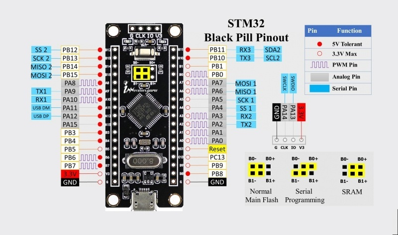

# Настройка порта GPIO   

Все примеры для микроконтроллера STM32F103C8. В моем распоряжении есть отладочная плата stm32f1038t6 Black Pill. На ней установлен кварцевый резонатор на 8 МГц и светодиод на порту PB12. Вот этим светодиодом я буду моргать.    
   

```
Настраиваем PB12 на выход в режиме push-pull и с помощью регистра ODR дергаем 12-й пин порта GPIOB туда-сюда.
```

Создадим функцию инициализации порта:
```c
void PortInit(void) {
}
```   
Первым делом включаем тактирование порта GPIOB:
```c
RCC->APB2ENR |= RCC_APB2ENR_IOPBEN; //Включаем тактирование порта GPIOB
```   
Далее настройка порта. Нам нужен пин PB12. Его конфигурационные биты находятся в регистре CRH:
```c
GPIOB->CRH &= ~(GPIO_CRH_MODE12 | GPIO_CRH_CNF12); //для начала все сбрасываем в ноль
//MODE: выход с максимальной частотой 2 МГц
//CNF: режим push-pull
GPIOB->CRH |= (0x02 << GPIO_CRH_MODE12_Pos) | (0x00 << GPIO_CRH_CNF12_Pos);
```   
Теперь управление. Для этого нам понадобится регистр ODR
```c
void PortSetHi(void) {
  GPIOB->BSRR = (1<<12);
}

void PortSetLow(void) {
  GPIOB->BRR = (1<<12);
}
```   
Конструкции (1<<12) превращаются в битовую маску 0x1000 на этапе компиляции, и у нас получается только одна операция записи в регистр BSRR или BRR   

main() для проверки:
```c
void main() {
    int i;
    PortInit();

    for(;;) {
        PortSetHi();
        for(i=0; i<0x40000; i++);
        PortSetLow();
        for(i=0; i<0x40000; i++);
    }
}
```