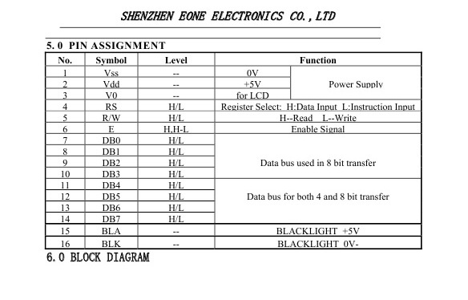
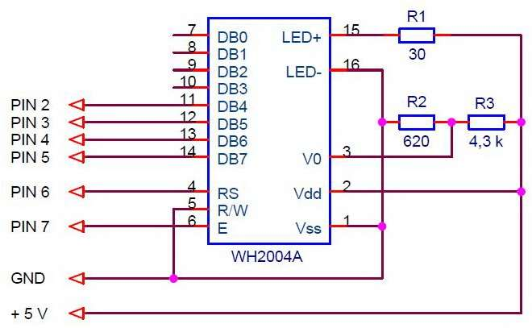
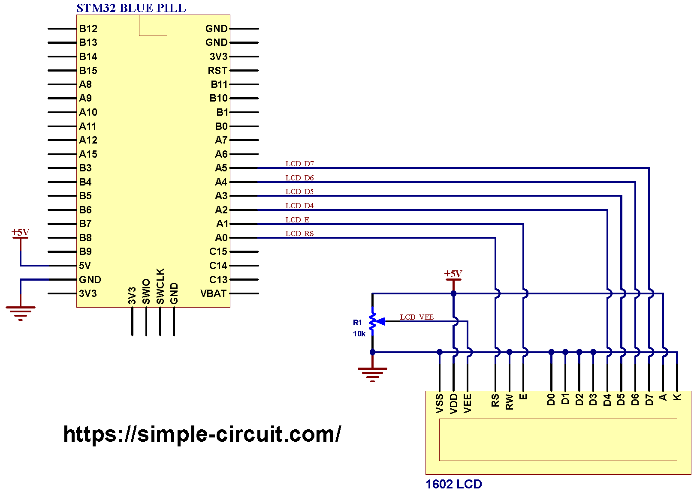

# Дисплей LCD WH1602A   

1. Назначение пинов   
  
2. Схема подключения  
  

# Что означают VCC, VDD, VEE, VSS и VBAT на схематической диаграмме?   

1. VCC: C=цепь означает цепь, т. е. напряжение, подключенное к цепи.   
2. VDD: D=устройство означает устройство, то есть внутреннее рабочее напряжение устройства.   
3. VSS: серия S= означает общее соединение, обычно относится к напряжению клеммы общего заземления цепи.   
4. VEE: подача отрицательного напряжения; источник (S) полевой трубки   
5. VBAT: при подключении к контакту VBAT с помощью батареи или другого источника питания содержимое резервного регистра может быть сохранено, а RTC будет поддерживаться при отключении питания VDD. Если в приложении не используется внешняя батарея, вывод VBAT следует соединить с выводом VDD.   
6. VPP: Напряжение программирования/стирания.   
7. GND: Часто обозначается как база опорного напряжения в цепях.   
8. Разница между V и VA заключается в следующем: цифровое или аналоговое.   
    * Питание цифровых цепей VCC   
    * Питание аналоговой цепи VCCA   
    * VDD - это цифровое рабочее напряжение, то есть подача питания в микросхему   
    * VDDA - это аналоговое напряжение или аналоговый положительный источник питания, который подает питание от микросхемы наружу.   
      The difference between CC and DD is: the difference between the supply voltage and the working voltage (usually VCC>ВДД)   

